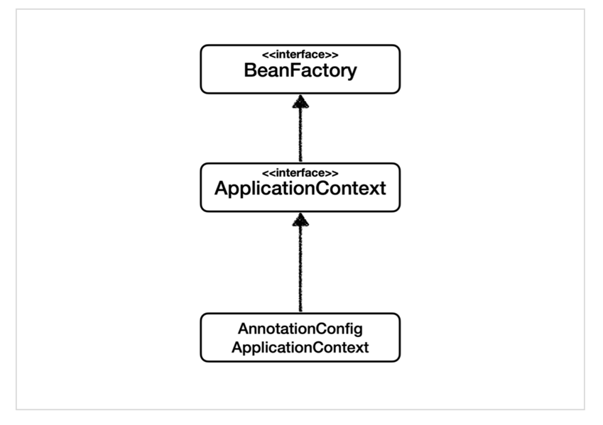
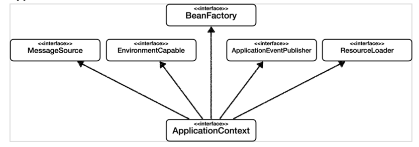

## Bean
- 스프링이 IoC 방식으로 관리하는, 스프링이 직접 그 생성과 제어를 담당하는 객체

## Bean Factory - 빈 팩토리
- 스프링의 IoC 를 담당하는 핵심 컨테이너
- 빈을 등록, 생성, 조회 및 그 외에 부가적인 빈을 관리하는 기능을 담당
  - 일반적으로 BeanFactory 를 직접 사용하지 않고 BeanFactory 를 확장한 ApplicationContext 를 사용함
### Bean 등록
  - @Configuration 이 붙은 클래스의 @Bean 이 붙은 모든 메서드를 호출하여 반환되는 객체를 등록
  - @ComponentScan 의 스캔 범위에 있는 @Component 가 붙은 모든 클래스의 객체를 등록

## ApplicationContext - 스프링 컨테이너
- Bean Factory 를 확장한, BeanFactory 를 상속한 IoC 컨테이너  
    
- 빈 팩토리의 기본적인 기능 외에 스프링이 제공하는 각종 부가 서비스를 추가로 제공  
    
  - 메시지소스를 활용한 국제화 기능
  - 환경 변수 관리
    - 로컬, 개발, 운영 등을 구분해서 처리
  - 애플리케이션 이벤트
    - 이벤트를 발행하고 구독하는 모델을 편리하게 지원
  - 편리한 리소스 조회
    - 파일, 클래스패스, 외부 등에서 리소스를 편리하게 조회
### 스프링 컨테이너의 생성 과정
  1. 스프링 컨테이너 생성  
    
  2. 스프링 빈 등록
      
    *빈 이름은 기본적으로 메서드 이름을 사용하며 직접 부여할 수도 있다.*
  3. 스프링 빈 의존관계 설정 준비  
    
  4. 스프링 빈 의존관계 설정 완료  
      
### 스프링 빈 조회
  - ApplicationContext.getBean(빈 이름, 빈 클래스 타입)
  - ApplicationContext.getBean(빈 클래스 타입)
    - 같은 타입의 빈이 둘 이상 있으면 예외가 발생할 수 있음. 그런 상황에는 빈 이름을 지정하여 조회
    - 타입으로 조회시 자식 타입도 조회 대상이 된다.
      - Object 타입으로 조회하면 모든 빈이 조회된다.
### 싱글톤 컨테이너
- 스프링 컨테이너는 기본적으로 빈 객체들을 싱글톤 객체로 관리함
  - 빈 객체의 생명주기를 필요에 따라 별도로 설정하는 것도 가능
- 싱글턴 패턴을 위한 지저분한 코드를 작성하지 않아도 됨
  - DIP, OCP, private 생성자로부터 자유롭게 싱글톤을 사용할 수 있음
- 싱글톤 방식의 주의점
  - 여러 요청(쓰레드)의 순서 및 보안이 보장되지 않으므로 싱글톤 객체는 상태값을 보관해서는 안된다.
    - final 외의 다른 필드로 상태값을 임시로 저장하는 용도로 쓰지 않는 것을 권장

## @Configuration
- @Configuration 이 붙은 클래스 및 해당 클래스 안의 @Bean 이 붙은 메서드들이 반환하는 객체들을 빈 객체로 등록
  - 정확히는 @Configuration 가 붙은 클래스가 아닌 CGLIB 라이브러리를 통해 바이트코드가 조작된 클래스를 등록
    - @Bean 이 붙은 메서드들을 오버라이딩한 클래스로 오버라이딩 된 메서드를 통해 싱글톤을 보장해준다.
  - 바이트코드가 조작된 클래스는 기존 클래스를 부모 클래스로 둔 타입이다.
    ```java
    @Configuration
    public class AppConfig {
    
        @Bean
        public MemberService memberService() {
            return new MemberServiceImpl(memberRepository());
        }
    
        @Bean
        public MemberRepository memberRepository() {
            return new MemoryMemberRepository();
        }
    
        @Bean
        public OrderService orderService() {
            return new OrderServiceImpl(memberRepository(), discountPolicy());
        }
    
        @Bean
        public DiscountPolicy discountPolicy() {
            return new RateDiscountPolicy();
        }
    }
    
    // CGLIB 를 통해 바이트코드가 조작된 예상 코드
    @Configuration
    public class AppConfig {
    
        @Bean
        public MemberRepository memberRepository() {
            if (memberRepository 가 스프링 컨테이너에 있을 경우) {
                return 스프링 컨테이너에 있는 memberRepository
            }
    
            return new MemoryMemberRepository();
        }
    }
    ```