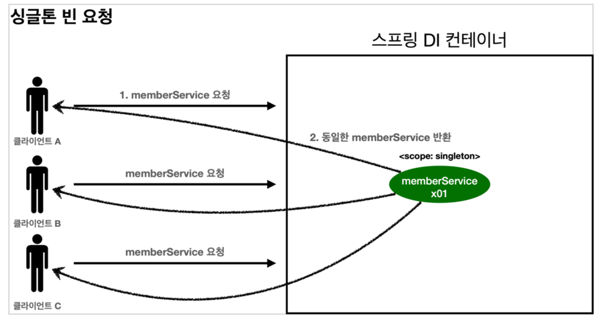
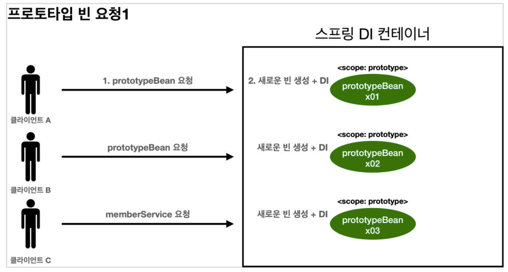
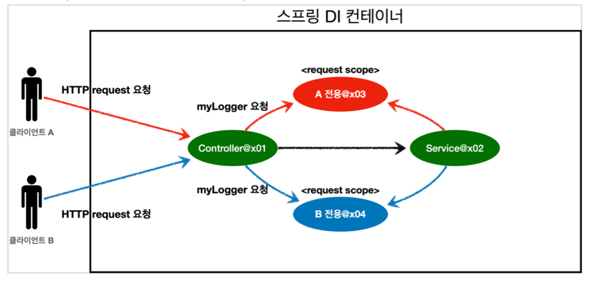

## Bean Scope
- 빈 객체가 존재할 수 있는 범위

### Bean Scope 의 종류
- 싱글톤
  - 기본 스코프. 스프링 컨테이너의 시작과 종료까지 유지되는 가장 넓은 범위의 스코프
    - 빈 객체가 스프링 컨테이너 생성 시점에 같이 생성되고 컨테이너 종료시에 소멸
  - 빈 객체를 요청시에 스프링 컨테이너는 모든 요청에 같은 객체를 반환  
    
- 프로토타입
  - 스프링 컨테이너가 빈의 생성과 의존관계 주입까지만 관여하고 더는 관리하지 않는 짧은 범위의 스코프
  - 빈 객체를 요청시에 스프링 컨테이너는 요청때마다 해당 타입의 빈 객체를 새로 생성하여 반환
  - 실무에서는 자주 사용되지는 않는다. 싱글톤이 아니므로 요청 때마다 객체가 생성되는 성질이 메모리 소모에 부담을 줄 수 있으므로 되도록
  프로토타입을 사용하지 않는 방향으로 설계해야 한다.
  - 생성 후 스프링 컨테이너가 관리하지 않으므로 이후 빈 객체의 @PreDestroy 같은 종료 메서드는 
    해당 객체를 사용하는 클라이언트 쪽에서 호출 해줘야 한다.  
    

### Bean Scope 지정
```java
@Scope("prototype")
@Component
public class MemberService {}


public class Config {
    
  @Scope("prototype")
  @Bean
  public MemberService memberService() {}
  
}

@Component
@RequiredArgsConstructor
public class OrderService1 {
    private final MemberService memberService;
}

@Component
@RequiredArgsConstructor
public class OrderService2 {
  // OrderService1 내부의 memberService 객체와는 다른 객체가 새로 생성되어 주입된다.
  private final MemberService memberService;
} 
```

<br/>

## Web Scope
- 웹 환경에서만 동작하는 범위
- 빈 스코프의 프로토타입과는 다르게 스프링이 스코프의 종료시점까지 관리함

### Web Scope 의 종류
- Request
  - 웹 요청이 들어오고 나갈 때까지 유지되는 스코프
  - 각각의 HTTP 요청마다 별도의 빈 객체가 생성되고 관리됨  
    
- Session
  - 웹 세션이 생성되고 종료될 때까지 유지되는 스코프
- Application
  - 웹의 서블릿 컨텍스트와 같은 범위로 유지되는 스코프
```java

@Scope("request")
@Component
public class MemberRequest {
  // 스프링 컨테이너 생성시 해당 타입의 빈은 생성되지 않으므로 다른 빈에서 해당 타입의 객체를 주입받으려 할 때 오류가 발생한다.
}
```

