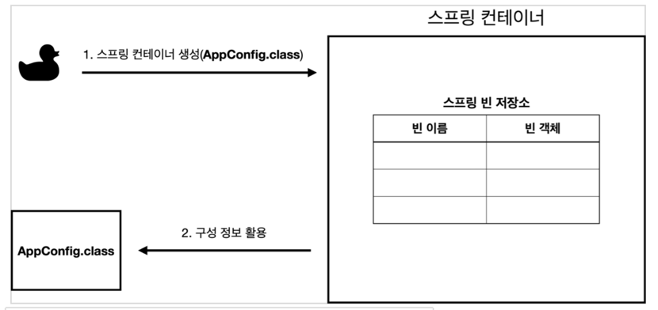
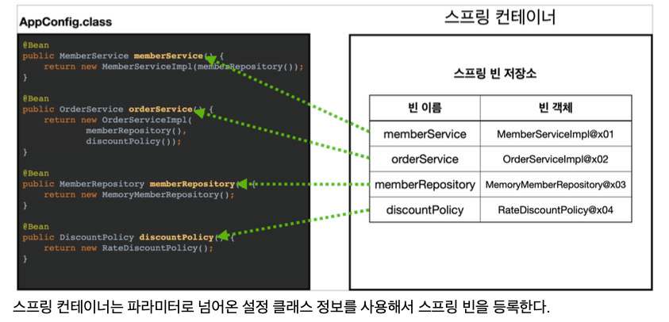
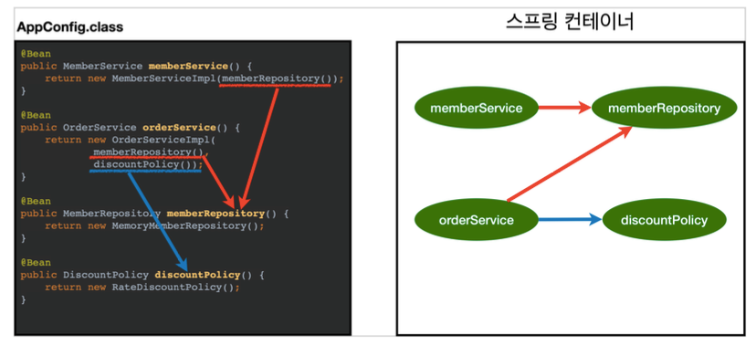

## Bean
- 스프링이 IoC 방식으로 관리하는, 스프링이 직접 그 생성과 제어를 담당하는 객체

## Bean Factory - 빈 팩토리
- 스프링의 IoC 를 담당하는 핵심 컨테이너
- 빈을 등록, 생성, 조회 및 그 외에 부가적인 빈을 관리하는 기능을 담당
  - 일반적으로 BeanFactory 를 직접 사용하지 않고 BeanFactory 를 확장한 ApplicationContext 를 사용함
- Bean 등록
  - @Configuration 이 붙은 클래스의 @Bean 이 붙은 모든 메서드를 호출하여 반환되는 객체를 등록
  - @ComponentScan 의 스캔 범위에 있는 @Component 가 붙은 모든 클래스의 객체를 등록

## ApplicationContext - 스프링 컨테이너
- Bean Factory 를 확장한, BeanFactory 를 상속한 IoC 컨테이너
- 빈 팩토리의 기본적인 기능 외에 스프링이 제공하는 각종 부가 서비스를 추가로 제공
- 스프링 컨테이너의 생성 과정
  1. 스프링 컨테이너 생성  
    
  2. 스프링 빈 등록
      
    *빈 이름은 기본적으로 메서드 이름을 사용하며 직접 부여할 수도 있다.*
  3. 스프링 빈 의존관계 설정 준비  
    
  4. 스프링 빈 의존관계 설정 완료  
      