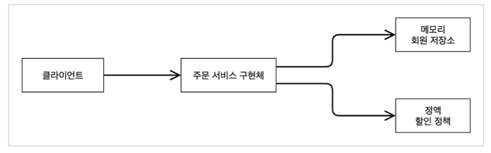

## 제어의 역전. IoC - Inversion of Control
- 프로그램의 제어 흐름이 클라이언트에서 직접 제어하는 것이 아닌 외부로부터 흐름 제어를 받게 되는 소프트웨어 디자인 패턴
- 클라이언트에서 필요한 객체를 생성하여 이용하는 일반적인 흐름과는 달리 필요한 객체를 외부에서 생성 및 관리,주입해주는 구조를 띈다.
- 제어 역전의 목적
  - 작업을 구현하는 방식과 작업 수행 자체를 분리
  - 모듈을 제작할 때, 모듈과 외부 프로그램의 결합에 대해 고민할 필요 없이 모듈의 목적에 집중할 수 있음
  - 다른 시스템이 어떻게 동작할지에 대해 고민할 필요 없이, 미리 정해진 협약대로만 동작하게 하면 됨
  - 모듈을 바꾸어도 다른 시스템에 부작용을 일으키지 않는다.
    - 인터페이스로만 외부 모듈을 의존. 실제 사용되는 구현 객체는 외부에서 결정

## 의존관계 주입
- 애플리케이션 실행 시점에 외부에서 실제 구현 객체를 생성하고 클라이언트에 전달해서 클라이언트와 서버의 실제 의존관계를 연결 시키는 것
  - 실행 전 정적인 클래스 의존 관계
      
  - 애플리케이션 실행 시점의 실제 의존관계
    
    - 객체 인스턴스를 생성하고, 그 참조값을 전달해서 연결
    - 의존관계 주입을 사용하면 클라이언트 코드를 변경하지 않고, 클라이언트가 호출하는 대상의 타입 인스턴스를 변경할 수 있다.
    - 의존관계 주입을 사용하면 정적인 클래스 의존관계를 변경하지 않고, 동적인 객체 인스턴스 의존관계를 쉽게 변경할 수 있다.

## IoC / DI Container
- 객체를 생성하고 관리하면서 의존관계를 연결해주는 컨테이너
- 어셈블러, 오브젝트 팩토리 등으로 불리기도 함
  ```java
  public class AppConfig {
  
      public MemberService memberService() {
          return new MemberServiceImpl(memberRepository());
      }
  
      private MemberRepository memberRepository() {
          return new MemoryMemberRepository();
      }
  
      public OrderService orderService() {
          return new OrderServiceImpl(memberRepository(), discountPolicy());
      }
  
      /** 할인 정책을 변경시 해당 부분만 변경하면 된다. */
      public DiscountPolicy discountPolicy() {
  //        return new FixDiscountPolicy();
          return new RateDiscountPolicy();
      }
  }
  ```